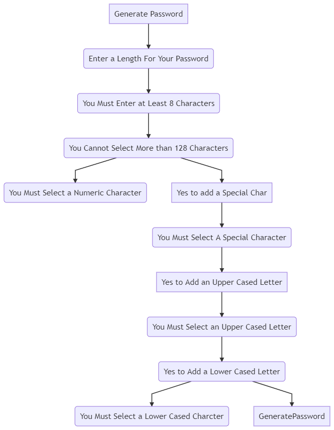

# Random Generated Password
- [Demo](#Preview) 
- [Password-Generator](#Password-Generator)
- [Diagram](#Diagram)
- [End](#End)


# Preview
* Video
    - [DemoVideo-Screencastify](https://drive.google.com/file/d/1L1yUcwEPSP_LAG70lC-TC9vYMNvZiQys/view); ![demo of psw_generator]

    * Prompt()
    * Determine Length of Password
        - [x] Password Must Be at Least 8 Characters
        - [ ] You must enter a number.
        - [x] Password must not be more than 128 Characters.
    * Confirm List of Character Requirements
        - [ ] You Must Select a Special Character 
        - [x] "Okay"
        - [ ] You Must Select an Upper Cased Letter 
        - [x] "Okay
        - [ ] You Must Select a Lower Cased Letter
        - [x] "Okay"
# Password-Generator
 
   ```javascript

//creating an array to set a random, generated psw
function getRandom(arr) {
let randomI = Math.floor(Math.random() \* arr.length);
let randomE = arr[randomI];
return randomE;
} // function to retrieve input and trigger random character selection
function generatePassword() {
let options = getSelection();
let result = [];
}
  // for loop to iterate password length

  for (var i = 0; i < options.length; i++) {
    var possibleChar = getRandom(possibleChar);

    result.push(possibleChar);
  }
  for (var i = 0; i < setChar.length; i++) {
    result[i] = setChar[i];
  }
  return result.join([i]);
}

````
|wrapper|card|
--------|-----
|GeneratePWD|Confirm|
|card-body|cardfooter|

# Diagram

```mermaid

graph TD;
  SubGraph1 --> SubGraph1Flow
  subgraph "You Must select >=8 and <=128"
  * SubGraph1Flow(SubNode 1)
  end
  subgraph "Generate A New Password"
  Node1[Node 1] --> Node2[Node 2]
   * SubGraph1Flow -- HowManyChar --> EnterNumericChar[Must be >=8 and <=128]
  Node2 --> SubGraph1[MustSelectYes]
  SubGraph1 -->GeneratePossibleChar[GenerateRandomPassword]

* SubGraph1Flow -- YesforSpecialChar --> ClickOkay
* SubGraph1Flow -- YesforUpperCase --> ClickOkay
* SubGraph1Flow -- YesForLowerCase --> ClickOkay
end
````

https://mermaid.ink/img/eyJjb2RlIjoiZ3JhcGggVERcbiAgICBBW0dlbmVyYXRlIFBhc3N3b3JkXSAtLT5CKEVudGVyIGEgTGVuZ3RoIEZvciBZb3VyIFBhc3N3b3JkKVxuICAgIEIgLS0-IEMoWW91IE11c3QgRW50ZXIgYXQgTGVhc3QgOCBDaGFyYWN0ZXJzKSAtLT4gRShZb3UgQ2Fubm90IFNlbGVjdCBNb3JlIHRoYW4gMTI4IENoYXJhY3RlcnMpLS0-IEQoWW91IE11c3QgU2VsZWN0IGEgTnVtZXJpYyBDaGFyYWN0ZXIpXG4gICAgRS0tPiBGW1llcyB0byBhZGQgYSBTcGVjaWFsIENoYXJdLS0-IEcoWW91IE11c3QgU2VsZWN0IEEgU3BlY2lhbCBDaGFyYWN0ZXIpXG4gICAgRy0tPkhbWWVzIHRvIEFkZCBhbiBVcHBlciBDYXNlZCBMZXR0ZXJdLS0-TChZb3UgTXVzdCBTZWxlY3QgYW4gVXBwZXIgQ2FzZWQgTGV0dGVyKS0tPiBJKFllcyB0byBBZGQgYSBMb3dlciBDYXNlZCBMZXR0ZXIpLS0-IEsoWW91IE11c3QgU2VsZWN0IGEgTG93ZXIgQ2FzZWQgQ2hhcmN0ZXIpXG4gICAgSS0tPkpbR2VuZXJhdGVQYXNzd29yZF0iLCJtZXJtYWlkIjp7InRoZW1lIjoiZGVmYXVsdCJ9LCJ1cGRhdGVFZGl0b3IiOmZhbHNlfQ

# End
- [Back To Top](#Random-Generated-Password)